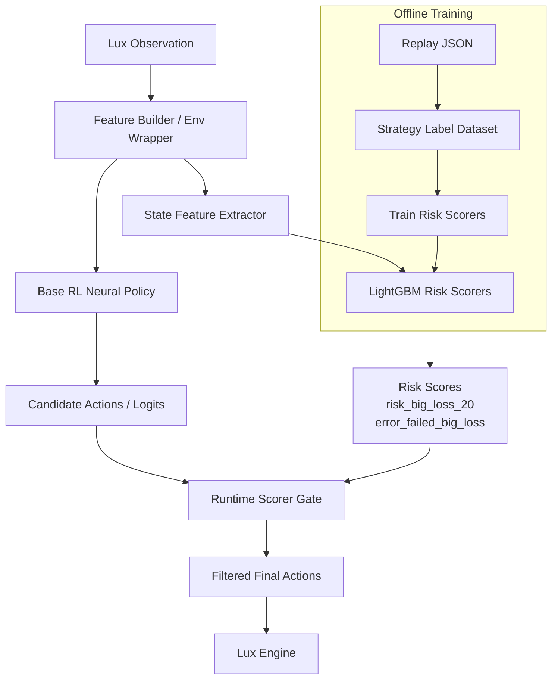

# Methodology And Architecture

## Methodology

Our method starts from a strong reinforcement-learning agent and adds a non-intrusive runtime safety layer. The base neural policy remains the main decision maker. Instead of directly fine-tuning the actor, we mine replay data to train lightweight diagnostic models that estimate whether the current state is likely to lead to a large future city loss.

The motivation is that direct actor fine-tuning can easily damage a strong Lux AI policy. A small change in one worker or city-tile action can shift the future state distribution, and the policy may enter positions that the original agent rarely visited. In our experiments, behavior cloning and reward-only fine-tuning often reduced city loss in one dimension but also harmed expansion, unit count, or side stability. Therefore, we use a separate diagnostic layer as an external safety mechanism.

The runtime gate follows three principles:

1. Preserve the base policy whenever risk is low.
2. Intervene only in high-risk states predicted by the diagnostic scorer.
3. Restrict the intervention scope to selected dangerous actions, currently focused on city-tile `BUILD_WORKER`.

This makes the method different from a hand-written rule agent. The rule does not decide the full strategy. It only acts as a narrow safety filter around a learned RL policy.

## Replay-Based Risk Learning

The diagnostic layer is trained from replay-derived labels. For every replay state, we extract scalar features such as:

- map size and turn
- day/night cycle
- city tile count and unit count
- worker-to-city ratio
- fuel, upkeep, and fuel buffer statistics
- low-fuel city counts
- resource availability

The main labels describe future risk:

- `risk_big_loss_20`: whether a large city loss occurs within a future window
- `error_failed_big_loss`: whether the state is associated with both large loss and a bad final result

These labels allow the gate to focus on harmful city loss rather than treating every city loss as equally bad. This is important because Lux AI 2021 is decided by final city tiles and units, not directly by intermediate city loss.

## Runtime Architecture



## Neural Policy

The base policy is the original RL model. It processes the game observation through the bundled Lux environment wrappers and neural network. It outputs city-tile and unit actions, then applies collision handling and legality checks.

The gate does not replace this neural policy. If the scorer files are missing or fail to load, the system falls back to the base policy.

## Gate Logic

At inference time, the scorer is evaluated once per turn. If predicted risk is below threshold, the base policy action is used unchanged. If risk is high, the gate marks selected dangerous actions as illegal before final action resolution.

Current intervention target:

```text
BUILD_WORKER
```

The gate is map-size aware. For 12x12, 16x16, and 24x24 maps it uses a shared timing profile. For 32x32 maps, intervention is delayed because large maps benefit from expansion for longer.

## Future Extension

The current gate threshold is manually configured. A natural next step is to learn the gate decision itself:

- train an action-level intervention classifier from replay outcomes
- optimize thresholds on held-out seeds
- use offline contextual bandit learning to decide whether blocking an action improves final win/city outcome
- keep a KL/behavior anchor to the base policy during any further RL adaptation

This would preserve the current architecture while reducing manual threshold tuning.
